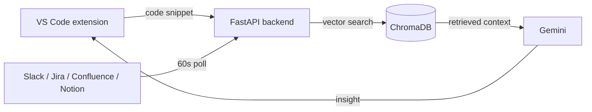

# ContextSync — Institutional Memory as a Service

[](https://github.com/AkashNaickar/ContextSync/actions/workflows/ci.yml)
[](LICENSE)


> **Stop coding in the dark.** ContextSync bridges your IDE and your team's conversations, surfacing critical historical context (Slack threads, Jira tickets, Confluence pages, Notion docs) right where you write code.

**Live backend:** https://contextsync-backend.onrender.com (health check at `/`)

## The problem

You are reviewing code that looks perfect. It has retry logic. It catches exceptions. It passes the linter. It passes CI/CD.
**But it's wrong.**
Because months ago, a staff engineer mentioned in a Slack thread that "Gateway V2 requires an Idempotency Key".
You didn't see that message. **ContextSync did.**

## Features

- **Explain intent** — highlight code and get an explanation of *why* it exists based on historical context, not just syntax.
- **Context cards** — raw Slack threads and Jira tickets surfaced directly in a VS Code sidebar.
- **RAG engine** — ChromaDB vector search across your engineering history (Slack, Jira, Confluence, Notion).
- **Background sync** — polls connected sources every 60 seconds; manual sync via `POST /context/sync`.
- **Chat** — ask questions with optional code context attached.

## Architecture



## API

| Method | Path | Purpose |
|--------|------|---------|
| GET | `/` | Health check |
| POST | `/explain` | Markdown explanation of a code snippet using retrieved context |
| POST | `/context/retrieve` | Structured context objects for the IDE |
| POST | `/context/stats` | Slack/Jira counts for a batch of snippets |
| POST | `/chat` | Chat with Gemini, optional context |
| POST | `/context/sync` | Manually trigger ingestion from connected sources |
| POST | `/context/ingest` | Webhook receiver for external events |

## Quick start

### 1. Backend

```bash
cd backend
python -m venv venv
source venv/bin/activate        # Windows: venv\Scripts\activate
pip install -r requirements.txt -r requirements-dev.txt
cp .env.example .env            # then fill in GOOGLE_API_KEY (required)
uvicorn app.main:app --reload
```

The server starts even without integration credentials — only the root health check and webhook endpoints work until `GOOGLE_API_KEY` is set.

### 2. VS Code extension

```bash
cd vscode-extension
npm install
npm run compile
# Press F5 to launch the Extension Development Host
```

Set `contextsync.apiBaseUrl` in VS Code settings to point at your backend (default `http://127.0.0.1:8000`).

### 3. Run the tests

```bash
cd backend
pytest -q
ruff check app tests ingest.py
```

## Environment variables

Copy `.env.example` to `backend/.env`. Only `GOOGLE_API_KEY` is required; everything else enables an optional integration.

| Variable | Required | Used for |
|----------|----------|----------|
| `GOOGLE_API_KEY` | Yes | Gemini embeddings + chat |
| `SLACK_BOT_TOKEN` | No | Live Slack ingestion |
| `SLACK_SIGNING_SECRET` | No | Slack webhook verification |
| `SLACK_CHANNEL_ID` | No | Which Slack channel to poll |
| `JIRA_DOMAIN` | No | Jira cloud domain |
| `JIRA_EMAIL` | No | Jira auth email |
| `JIRA_API_TOKEN` | No | Jira API token |
| `JIRA_JQL` | No | Jira query (has sensible default) |
| `CONFLUENCE_URL` | No | Confluence base URL |
| `CONFLUENCE_USERNAME` | No | Confluence auth |
| `CONFLUENCE_API_TOKEN` | No | Confluence API token |
| `NOTION_API_KEY` | No | Notion integration token |
| `NOTION_SEARCH_QUERY` | No | Notion search query |

## Deployment

The backend ships with a `Dockerfile` (in `backend/`) and a `render.yaml` blueprint.

### Render (used for the live demo)

1. In the Render dashboard, create a **Web Service** from this repo.
2. Root directory `backend`, runtime Python 3.11, build `pip install -r requirements.txt`, start `uvicorn app.main:app --host 0.0.0.0 --port $PORT`.
3. Add the environment variables from the table above (at minimum `GOOGLE_API_KEY`).
4. Free-tier instances sleep after inactivity; the first request after a cold start may take ~30s.

### Docker

```bash
cd backend
docker build -t contextsync-backend .
docker run -p 8000:8000 --env-file .env contextsync-backend
```

The VS Code extension is not deployable to a URL — it runs inside VS Code via F5 or a packaged `.vsix`.

## Demo scenario

The `demo/` folder contains a deliberately dangerous payment processor (`payment_processor.py`). Use it to see ContextSync detect the missing "Idempotency Key" by cross-referencing Slack history.

## Roadmap

- [ ] Per-relevance scoring surfaced in context cards (currently a placeholder `0.0`)
- [ ] Slack webhook-driven ingestion instead of 60s polling
- [ ] Extension test suite (VS Code extension host tests)
- [ ] Persisted ChromaDB on a managed volume for cloud deploys

## Contributing

1. Fork the repo and create a branch (`git checkout -b feature/my-feature`)
2. Make your change and add tests
3. Run `pytest -q` and `ruff check` in `backend/`
4. Open a pull request

## License

[MIT](LICENSE)
